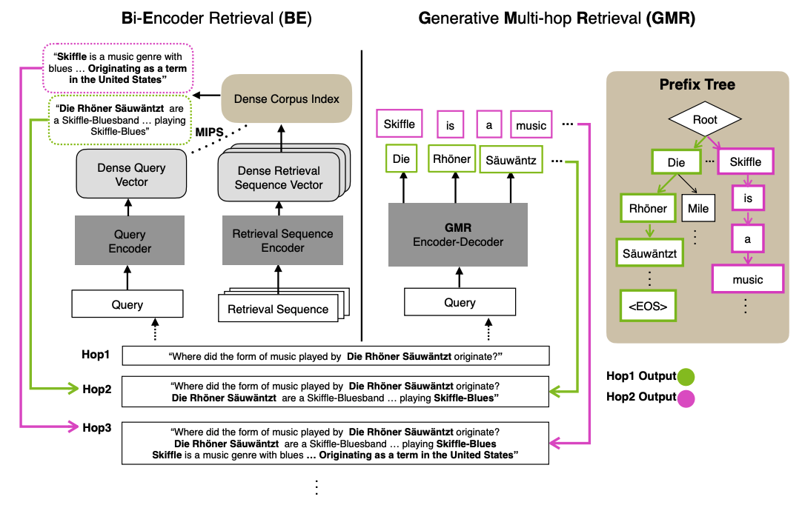

# Generative-Multihop-Retrieval



This is the official github repository for [Generative Multihop Retrieval](https://arxiv.org/abs/2204.13596), accepted at EMNLP 2022.

Use the following to cite our paper:
```
@inproceedings{Lee2022GenerativeMR,
  title={Generative Multi-hop Retrieval},
  author={Hyunji Lee and Sohee Yang and Hanseok Oh and Minjoon Seo},
  booktitle={Conference on Empirical Methods in Natural Language Processing},
  year={2022}
}
```

In order to reproduce our results, take the following steps:

## 1. Create conda environment and install requirements
```
conda create -n gmr python=3.7 && conda activate gmr
pip install -r requirements.txt
```

## 2. Download the data used for the experiments.
1. [EntailmentBank](https://allenai.org/data/entailmentbank)
2. [StrategyQA](https://allenai.org/data/strategyqa)
3. [Explagraphs-Open](https://github.com/swarnaHub/ExplaGraphs)
4. [RuleTaker-Open](https://allenai.org/data/ruletaker)
5. [HotpotQA](https://hotpotqa.github.io/)

Detailed preprocessing code is in process 

## 3. Set Config
Components in each configurations file
```
{
    "output_dir" (str): output directory to save all ckpt
    "dataset" (str): path to the dataset
    "model" (str): ['t5-base', 't5-large']
    "max_input_length" (int): max input length
    "max_output_length" (int): max output length
    "learning_rate" (float): learning rate (default: 1e-4)
    "lr_scheduler" (str): scheduler ['constant', 'exponential']
    "num_train_epochs" (int): training epoch (default: 150 with early stopping)
    "train_batch_size" (int): batch size for eval (default: 120)
    "eval_batch_size" (int): batch size for eval
    "gradient_accumulation_steps" (int): gradient accumulation size
    "n_gpu" (int): # of gpus
    "num_workers" (int): # of cpus
    "resume_from_checkpoint" (str): when resume training from ckpt
    "seed" (int): seed (default: 101)
    "check_val_every_n_epoch" (int): freq of validation (default: 3)
    "train_file" (str): path to train dataset
    "dev_file" (str): path to dev dataset
    "test_file" (str): path to test dataset
    "prefix_tree" (str): path to prefix tree
    "constrained_decoding" (bool): [true (default) | false]
    "do_train" (bool): [true | false], true if in train step else false
    "do_test" (bool): [true | false], true if in test step else false
    "setting" (str): ["ret_fixed", "ret_dynamic", "LM_mem", "multihop_mem"]
    "test_model_path" (str): path to test ckpt
    "beam_size" (int): beam size
    "ret_num" (int): # of sequences to return
    "wandb_log" (bool): log in wandb
    "wandb_project" (str): project name in wandb
    "wandb_run_name" (str): run name in wandb
    "accelerator" (str): [ddp (default) | deepspeed] 
}
```

## 4. Train Model
* config setting:
  ```
  do_train: true
  do_test: false
  ```

### Memorization Step
```
python train.py --config config/*
```
We are in the process of releasing code for memorization step!
* Language Model Memorization
  * `setting` in config should be `LM_mem`
* Multihop Memorization
  * `setting` in config should be `multihop_mem`

### Retrieval Step
```
python train.py --config config/*
```
* Fixed Setting
  * `setting` in config should be `ret_fixed`
* Dynamic Setting
  * `setting` in config should be `ret_dynamic`

## 5. Test Model
* config setting:
  ```
  do_train: true
  do_test: false
  ```
* run
  ```
  python train.py --config config/*
  ```

